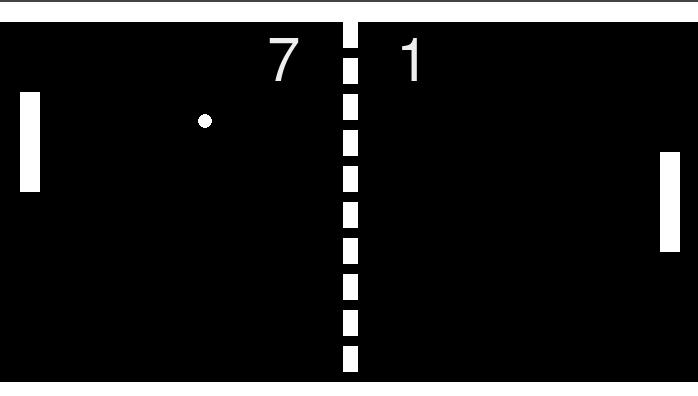

<h1> Pong Rewrite In Pygame </h1> 

 This repository contains Pong Rewrite in Python using pygame module. There are 2 modes. Play against AI (1 PLAYER) or friend (2 PLAYERS)

  

<h2> Install </h2>
<ol>
  <li> Make sure you have pip and python installed </li>
  <li> Clone this repo </li>
  <li> run pip install -r requirements.txt in your terminal/cmd </li>
  <li> run python main.py in your terminal/cmd </li>
</ol>
<h3> Instructions </h3>
<ol>
  <li> Use arrow keys up and down to move </li> 
</ol>
